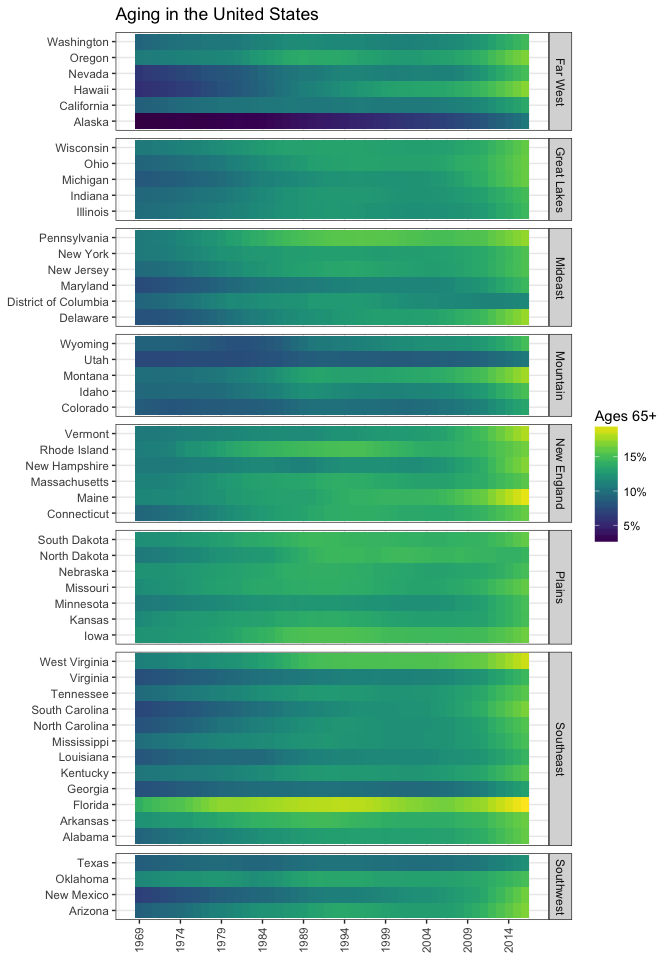

<!-- README.md is generated from README.Rmd. Please edit that file -->

[](https://travis-ci.org/jjchern/county.pop)
[](https://ci.appveyor.com/project/jjchern/county.pop)

# About `county.pop`

The package stores U.S. annual county-level population estimates
(1969-2016) from [SEER](https://seer.cancer.gov/popdata/download.html).
The dataset is unbalanced: certain counties do not have population
estimates for all the years.

# Installation

``` r
# install.packages("devtools")
devtools::install_github("jjchern/county.pop@v0.0.4")

# To uninstall the package, use:
# remove.packages("county.pop")
```

# Usage

## The package contains four datasets

``` r
library(tibble)
county.pop::pop_since_1969
#> # A tibble: 149,765 x 15
#>    state_fips usps  state   county_fips  year   pop black other white
#>    <chr>      <chr> <chr>   <chr>       <dbl> <int> <int> <int> <int>
#>  1 01         AL    Alabama 01001       1969. 23819  6879    19 16921
#>  2 01         AL    Alabama 01001       1970. 24661  6914    27 17720
#>  3 01         AL    Alabama 01001       1971. 25503  6948    36 18519
#>  4 01         AL    Alabama 01001       1972. 27156  7196    50 19910
#>  5 01         AL    Alabama 01001       1973. 28453  7352    62 21039
#>  6 01         AL    Alabama 01001       1974. 29261  7344    75 21842
#>  7 01         AL    Alabama 01001       1975. 29716  7294    83 22339
#>  8 01         AL    Alabama 01001       1976. 29892  7153    96 22643
#>  9 01         AL    Alabama 01001       1977. 30457  7145   107 23205
#> 10 01         AL    Alabama 01001       1978. 30879  7089   118 23672
#> # ... with 149,755 more rows, and 6 more variables: age_1_18 <int>,
#> #   age_19_44 <int>, age_45_64 <int>, age_65_85p <int>, female <int>,
#> #   male <int>

county.pop::pop_since_1969_adjusted
#> # A tibble: 149,766 x 15
#>    state_fips usps  state   county_fips  year   pop black other white
#>    <chr>      <chr> <chr>   <chr>       <dbl> <int> <int> <int> <int>
#>  1 01         AL    Alabama 01001       1969. 23819  6879    19 16921
#>  2 01         AL    Alabama 01001       1970. 24661  6914    27 17720
#>  3 01         AL    Alabama 01001       1971. 25503  6948    36 18519
#>  4 01         AL    Alabama 01001       1972. 27156  7196    50 19910
#>  5 01         AL    Alabama 01001       1973. 28453  7352    62 21039
#>  6 01         AL    Alabama 01001       1974. 29261  7344    75 21842
#>  7 01         AL    Alabama 01001       1975. 29716  7294    83 22339
#>  8 01         AL    Alabama 01001       1976. 29892  7153    96 22643
#>  9 01         AL    Alabama 01001       1977. 30457  7145   107 23205
#> 10 01         AL    Alabama 01001       1978. 30879  7089   118 23672
#> # ... with 149,756 more rows, and 6 more variables: age_1_18 <int>,
#> #   age_19_44 <int>, age_45_64 <int>, age_65_85p <int>, female <int>,
#> #   male <int>

county.pop::pop_since_1990
#> # A tibble: 84,718 x 16
#>    state_fips usps  state  county_fips  year   pop  hisp  nh_b  nh_o  nh_w
#>    <chr>      <chr> <chr>  <chr>       <dbl> <int> <int> <int> <int> <int>
#>  1 01         AL    Alaba… 01001       1990. 34353   213  6817   189 27134
#>  2 01         AL    Alaba… 01001       1991. 35010   227  6823   204 27756
#>  3 01         AL    Alaba… 01001       1992. 35985   245  6920   225 28595
#>  4 01         AL    Alaba… 01001       1993. 36953   264  7017   241 29431
#>  5 01         AL    Alaba… 01001       1994. 38186   305  7155   262 30464
#>  6 01         AL    Alaba… 01001       1995. 39112   332  7242   282 31256
#>  7 01         AL    Alaba… 01001       1996. 40207   382  7319   308 32198
#>  8 01         AL    Alaba… 01001       1997. 41238   439  7415   335 33049
#>  9 01         AL    Alaba… 01001       1998. 42106   479  7451   353 33823
#> 10 01         AL    Alaba… 01001       1999. 42963   550  7498   384 34531
#> # ... with 84,708 more rows, and 6 more variables: age_1_18 <int>,
#> #   age_19_44 <int>, age_45_64 <int>, age_65_85p <int>, female <int>,
#> #   male <int>

county.pop::pop_since_1990_adjusted
#> # A tibble: 84,719 x 16
#>    state_fips usps  state  county_fips  year   pop  hisp  nh_b  nh_o  nh_w
#>    <chr>      <chr> <chr>  <chr>       <dbl> <int> <int> <int> <int> <int>
#>  1 01         AL    Alaba… 01001       1990. 34353   213  6817   189 27134
#>  2 01         AL    Alaba… 01001       1991. 35010   227  6823   204 27756
#>  3 01         AL    Alaba… 01001       1992. 35985   245  6920   225 28595
#>  4 01         AL    Alaba… 01001       1993. 36953   264  7017   241 29431
#>  5 01         AL    Alaba… 01001       1994. 38186   305  7155   262 30464
#>  6 01         AL    Alaba… 01001       1995. 39112   332  7242   282 31256
#>  7 01         AL    Alaba… 01001       1996. 40207   382  7319   308 32198
#>  8 01         AL    Alaba… 01001       1997. 41238   439  7415   335 33049
#>  9 01         AL    Alaba… 01001       1998. 42106   479  7451   353 33823
#> 10 01         AL    Alaba… 01001       1999. 42963   550  7498   384 34531
#> # ... with 84,709 more rows, and 6 more variables: age_1_18 <int>,
#> #   age_19_44 <int>, age_45_64 <int>, age_65_85p <int>, female <int>,
#> #   male <int>
```

The population counts are usually based on July 1 populations. The two
adjusted versions take into account the changes in population due to
hurricanes Katrina and Rita.

All four data sets provide total population counts at the county-year
level, as well as population counts by

  - race (and ethnicity):
      - `pop_since_1969`: black, other, white
      - `pop_since_1990`: Hispanic, non-Hispanic black, non-Hispanic
        other, and non-Hispanic white
  - age groups (0-18, 19-44, 45-64, 65-85+), and
  - gender (female and male).

## New and Deleted Counties are Documented Properly

For example, Broomfield County, Colorado (08014) are created on November
15, 2001 (<https://www.census.gov/geo/reference/county-changes.html>).

``` r
library(tidyverse)
#> ── Attaching packages ───────────────────────────────── tidyverse 1.2.1 ──
#> ✔ ggplot2 2.2.1.9000     ✔ purrr   0.2.4     
#> ✔ tidyr   0.8.0          ✔ dplyr   0.7.4     
#> ✔ readr   1.1.1.9000     ✔ stringr 1.3.0     
#> ✔ ggplot2 2.2.1.9000     ✔ forcats 0.3.0
#> ── Conflicts ──────────────────────────────────── tidyverse_conflicts() ──
#> ✖ dplyr::filter() masks stats::filter()
#> ✖ dplyr::lag()    masks stats::lag()
#> ✖ dplyr::vars()   masks ggplot2::vars()
county.pop::pop_since_1990 %>% 
    filter(county_fips == "08014") %>% 
    distinct(year)
#> # A tibble: 15 x 1
#>     year
#>    <dbl>
#>  1 2002.
#>  2 2003.
#>  3 2004.
#>  4 2005.
#>  5 2006.
#>  6 2007.
#>  7 2008.
#>  8 2009.
#>  9 2010.
#> 10 2011.
#> 11 2012.
#> 12 2013.
#> 13 2014.
#> 14 2015.
#> 15 2016.
```

## State-Level Population Can be Aggregated Easily

``` r
county.pop::pop_since_1990 %>% 
    group_by(usps, year) %>% 
    summarise(state_pop = sum(pop))
#> # A tibble: 1,377 x 3
#> # Groups:   usps [?]
#>    usps   year state_pop
#>    <chr> <dbl>     <int>
#>  1 AK    1990.    553290
#>  2 AK    1991.    570193
#>  3 AK    1992.    588736
#>  4 AK    1993.    599432
#>  5 AK    1994.    603308
#>  6 AK    1995.    604412
#>  7 AK    1996.    608569
#>  8 AK    1997.    612968
#>  9 AK    1998.    619932
#> 10 AK    1999.    624779
#> # ... with 1,367 more rows
```

## Demographic Shifts


